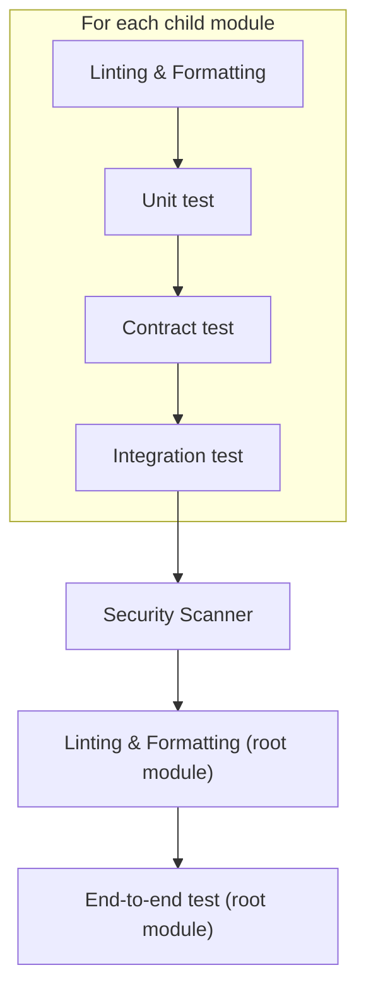

# Kubernetes The Hard Way On AWS

## Description

"Kubernetes The Hard Way On AWS" is a learning project aimed at understanding each task required to bootstrap a Kubernetes cluster. Unlike the original [Kubernetes The Hard Way](https://github.com/kelseyhightower/kubernetes-the-hard-way) by Kelsey Hightower, this project uses Terraform to provision the infrastructure and Ansible to configure the Kubernetes cluster. This project is designed to take the long route to ensure a deep understanding of deploying a Kubernetes cluster on AWS.

## Badges


[](https://lazyvim.org/)
[](http://creativecommons.org/licenses/by-nc-sa/4.0/)

## Visuals

### Infrastructure


### K8S Cluster


## Installation

### Requirements

- AWS Account
- AWS CLI
- Docker
- ... **WIP** ...

### Steps

1. Setup infrastructure prerequisites (S3 Terraform backend, IAM user & policy, PKI, ...):
   ```sh
   ./provisioning/prereq/bootstrap_prereq.sh
   ```

2. Provision the infrastructure with Terraform:
   ```sh
   ./k8s_manager.sh provision
   # Provision skipping tests: SKIP_TESTS="1" ./k8s_manager.sh provision
   # Plan: ./k8s_manager.sh plan
   ```



3. Configure the Kubernetes cluster with Ansible: **WIP**

4. Destroy the infrastructure:
   ```sh
   ./k8s_manager.sh destroy
   ```

## Usage

### Infrastructure
   ```sh
   # Update ~/.ssh/config to simplify ssh command
   [...]
Host k8s-hard-way-bastion
     HostName <bastion_public_dns>
     User ubuntu
     IdentityFile ~/.ssh/id_rsa_k8s_the_hard_way
     StrictHostKeyChecking no

Host k8s-hard-way-control-plane
     HostName <control_plane_private_dns>
     User ubuntu
     ProxyJump k8s-hard-way-bastion
     IdentityFile ~/.ssh/id_rsa_k8s_the_hard_way
     StrictHostKeyChecking no

   [...]
   # SSH to the control plane
   ssh k8s-hard-way-control-plane
   ```

### K8S Cluster

**WIP**

## Roadmap

- Implement high availability for the Kubernetes cluster
- Develop a hub-and-spoke network topology

## Contributing

This project is a personal learning endeavor, and contributions are not being accepted at this time.

## Developer Setup

**WIP**

### Requirements

- [pre-commit](https://pre-commit.com/)

### Steps

1. Clone this repo and cd
2. Install `pre-commit` hooks:
   ```sh
   pre-commit install
   ```
3. (Optional) Run pre-commit on all files:
   ```sh
   pre-commit run --all-files
   ```

## Authors and Acknowledgment

- **Hoarau Jerome** - [GitHub](https://github.com/hoaraujerome)

Special thanks to [Kelsey Hightower](https://github.com/kelseyhightower) for the original "Kubernetes The Hard Way".

## License

This project is licensed under the Creative Commons Attribution-NonCommercial-ShareAlike 4.0 International License. For more details, see the LICENSE file or visit http://creativecommons.org/licenses/by-nc-sa/4.0/.

## Project Status

This project is a work in progress and is actively maintained.
