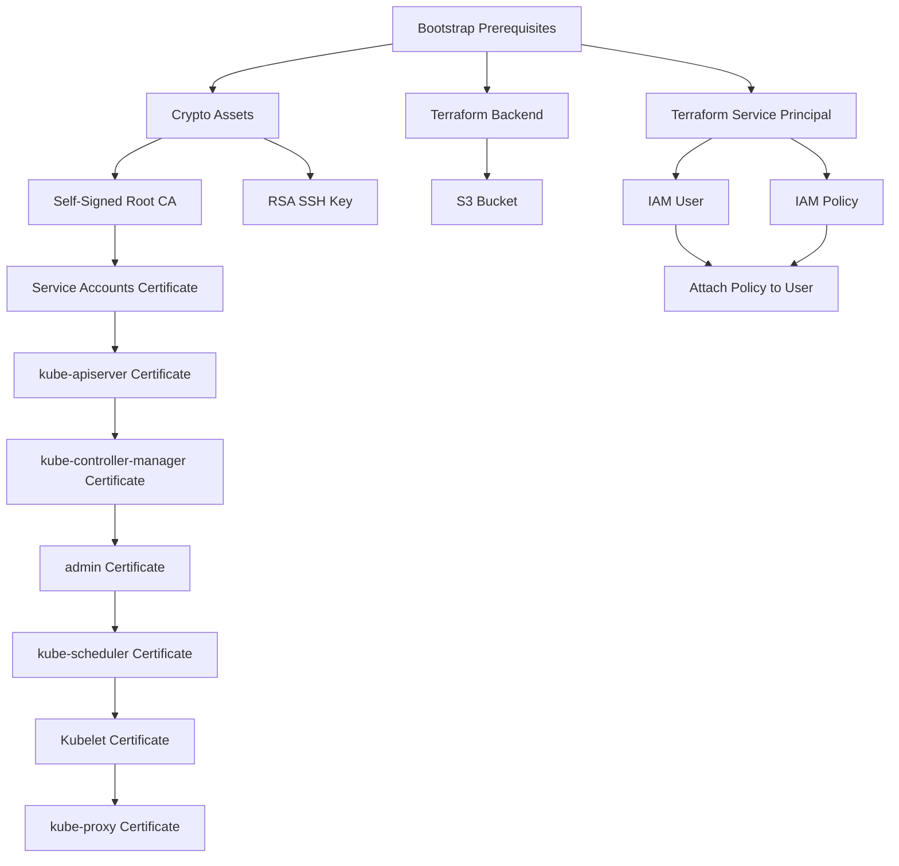
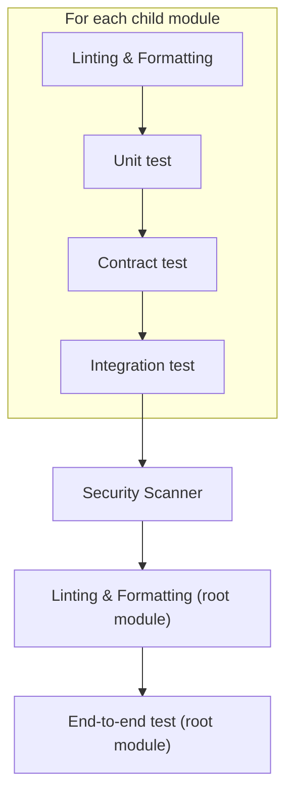
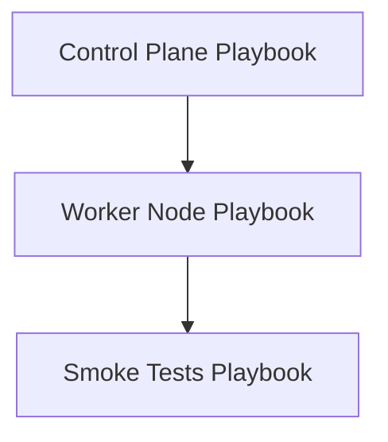

# Kubernetes The Hard Way On AWS

## Description

"Kubernetes The Hard Way On AWS" is a learning project aimed at understanding each task required to bootstrap a Kubernetes cluster. Unlike the original [Kubernetes The Hard Way](https://github.com/kelseyhightower/kubernetes-the-hard-way) by Kelsey Hightower, this project uses Terraform to provision the infrastructure and Ansible to configure the Kubernetes cluster. This project is designed to take the long route to ensure a deep understanding of deploying a Kubernetes cluster on AWS.

## Badges


[](https://lazyvim.org/)
[](http://creativecommons.org/licenses/by-nc-sa/4.0/)

## Visuals

### Infrastructure


### K8S Cluster


## Installation

### Requirements

- AWS Account
- AWS CLI configured
- Docker

### Steps

1. Setup prerequisites:
   ```sh
   ./provisioning/prereq/bootstrap_prereq.sh
   ```


2. Provision the infrastructure with Terraform:
   ```sh
   ./k8s_manager.sh provision
   # Provision skipping tests: SKIP_TESTS="1" ./k8s_manager.sh provision
   # Plan: ./k8s_manager.sh plan
   ```



3. Create the Kubernetes cluster with Ansible:
   ```sh
   ./k8s_manager.sh create
   ```


4. Delete the cluster and the infrastructure:
   ```sh
   ./k8s_manager.sh destroy
   ```

## Usage

* SSH to the control plane

   ```sh
   ./k8s_manager.sh troubleshoot
   ssh k8s_control_plane
   kubectl get secrets --kubeconfig=admin.kubeconfig
   NAME                      TYPE     DATA   AGE
   kubernetes-the-hard-way   Opaque   1      75s
   ```

* SSH to the worker node

   ```sh
   ./k8s_manager.sh troubleshoot
   ssh k8s_worker_node
   kubectl get nodes --kubeconfig=kubelet.kubeconfig
   NAME     STATUS   ROLES    AGE     VERSION
   node-0   Ready    <none>   5m27s   v1.31.1
   ```

## Contributing

This project is a personal learning endeavor, and contributions are not being accepted at this time.

## Developer Setup

### Requirements

- [pre-commit](https://pre-commit.com/)

### Steps

1. Clone this repo and cd
2. Install `pre-commit` hooks:
   ```sh
   pre-commit install
   ```
3. (Optional) Run pre-commit on all files:
   ```sh
   pre-commit run --all-files
   ```

## Authors and Acknowledgment

- **Hoarau Jerome** - [GitHub](https://github.com/hoaraujerome)

Special thanks to [Kelsey Hightower](https://github.com/kelseyhightower) for the original "Kubernetes The Hard Way".

## License

This project is licensed under the Creative Commons Attribution-NonCommercial-ShareAlike 4.0 International License. For more details, see the LICENSE file or visit http://creativecommons.org/licenses/by-nc-sa/4.0/.

## Project Status

This project is **done** and has been completed successfully as a learning project. It is no longer maintained.
